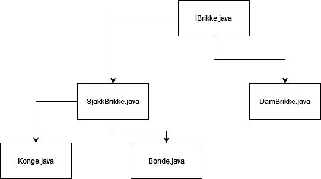

# Arv

Arv brukes når flere ulike klasser har like engenskaper

## Arv vs Interface
---
Felles
- Flere ulike klasser deler metoder

Arv
- Metodene fungerer likt innad i klassene

Interface
- Opp til klassen å definere logikk innad i en klasse

---
Hva om du vil ha noen metoder faste, og andre opp til klassene selv?

## Abstrakte klasser

Bilde av diagram

